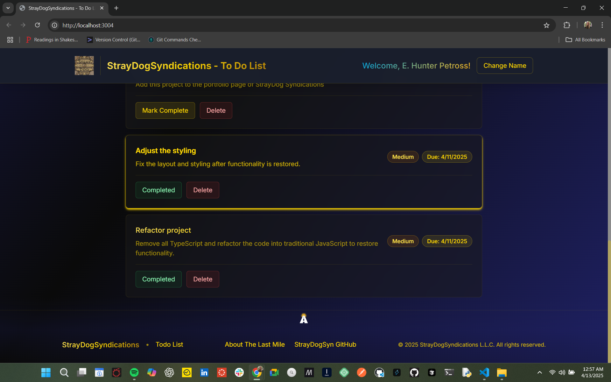
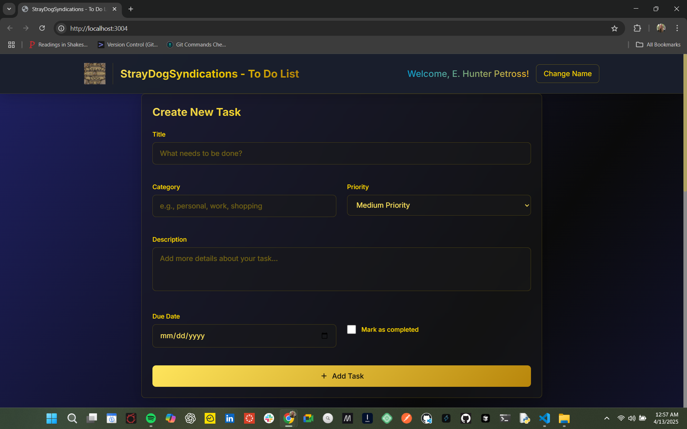

<div align="center">

# 🐾 StrayDog Todo List Application

### A Modern Full-Stack Task Management Solution

[](https://full-stack-to-do-list-hunter-fronte.vercel.app)
[](LICENSE)
[](https://vercel.com)

---

### 🛠️ Technology Stack

[](https://reactjs.org/)
[](https://nodejs.org/)
[](https://expressjs.com/)
[](https://www.mongodb.com/)
[](https://www.typescriptlang.org/)
[](https://tailwindcss.com/)
[](https://jestjs.io/)
[](https://eslint.org/)

</div>

---

## 📋 Table of Contents

- [🎯 Overview](#-overview)
- [✨ Key Features](#-key-features)
- [🏗️ Architecture](#️-architecture)
- [📸 Screenshots](#-screenshots)
- [🚀 Quick Start](#-quick-start)
- [⚙️ Installation](#️-installation)
- [🌐 Deployment](#-deployment)
- [📡 API Reference](#-api-reference)
- [🧪 Testing](#-testing)
- [👥 Team](#-team)
- [🔮 Roadmap](#-roadmap)
- [🤝 Contributing](#-contributing)
- [📫 Contact](#-contact)
- [📄 License](#-license)
- [📚 Documentation](#-documentation)

---

## 🎯 Overview

A sleek, production-ready todo list application featuring a modern React interface with client-side data persistence. Built with enterprise-grade practices and optimized for instant deployment, this application demonstrates professional development standards and clean architecture principles.

**Perfect for portfolio demonstrations - no backend infrastructure required!**

> 🚀 **Demo Mode**: The live deployment uses localStorage for data persistence, making it instantly accessible without database setup. All CRUD operations work seamlessly in the browser.

> 📚 **Comprehensive Documentation**: All deployment guides, migration details, and tutorials are available in the [`/docs`](./docs) folder.

## ✨ Key Features

### 🎨 Modern Task Management
- **Intuitive Interface** - Clean, responsive design that works flawlessly across all devices
- **Persistent Storage** - localStorage ensures your tasks survive browser sessions
- **Smart Filtering** - Efficiently organize and filter tasks by category, priority, and status
- **Responsive Design** - Mobile-first approach with Tailwind CSS

### 🔧 Technical Excellence
- **Client-Side Architecture** - No backend required, perfect for static hosting
- **Full TypeScript Support** - Type-safe code with comprehensive type definitions (backend)
- **Comprehensive Testing** - Jest test suites for quality assurance
- **Demo Data** - Pre-loaded sample tasks for first-time users
- **Production Ready** - Optimized build process and Vercel deployment

### 🛡️ Quality Assurance
- **ESLint Integration** - Consistent code quality standards
- **Automated Testing** - Unit and integration test coverage
- **Error Handling** - Graceful error management and user feedback
- **Environment Configuration** - Flexible configuration for different deployment scenarios

## 🏗️ Architecture

```
┌─────────────────┐
│   React Client  │
│  (TailwindCSS)  │
└────────┬────────┘
         │ HTTP/REST
         │
┌────────▼────────┐
│  Express.js API │
│   (Node.js)     │
└────────┬────────┘
         │ Mongoose ODM
         │
┌────────▼────────┐
│   MongoDB Atlas │
│   (Database)    │
└─────────────────┘
```

### Project Structure

- **`/frontend`** - React application with modern hooks and functional components
- **`/backend`** - Express.js server with TypeScript support
  - **`/controllers`** - Request handlers and business logic
  - **`/models`** - Mongoose schemas and data models
  - **`/routes`** - API endpoint definitions
  - **`/services`** - Business logic layer
  - **`/middleware`** - Error handling and request logging
  - **`/config`** - Database and environment configuration

## 📸 Screenshots

<div align="center">

### Application Interface



*Clean, intuitive task management interface*



*Responsive design with real-time updates*

</div>

---

## 🚀 Quick Start

### Live Demo

**👉 [View Live Application](https://full-stack-to-do-list-hunter-fronte.vercel.app)**

No setup required! The application runs entirely in your browser with localStorage persistence.

### Local Development

**Prerequisites:**
- Node.js 18.x or higher
- npm or yarn package manager

**Setup:**

```bash
# Clone the repository
git clone https://github.com/StrayDogSyn/full-stack-ToDoList-Hunter.git
cd full-stack-ToDoList-Hunter/frontend

# Install dependencies
npm install

# Start development server
npm start
```

The application will open at `http://localhost:3000`

### Features in Action

✅ **Create Tasks** - Add tasks with title, description, category, priority, and due date  
✅ **Filter & Sort** - Organize by category, priority, completion status  
✅ **Persistent Data** - Tasks automatically saved to localStorage  
✅ **Demo Data** - Sample tasks included for first-time users  

## ⚙️ Installation

### Frontend-Only Deployment (Current)

The application currently runs as a client-side React app with localStorage persistence:

```bash
# Install frontend dependencies
cd frontend
npm install

# Build for production
npm run build

# Deploy to Vercel, Netlify, or any static host
```

### Full-Stack Setup (Optional)

For developers wanting to explore the backend architecture:

**Backend Setup:**

```bash
cd backend
npm install

# Create .env file with MongoDB connection
echo "MONGODB_URI=your_mongodb_connection_string" > .env
echo "PORT=5001" >> .env

# Start backend server
npm start
```

**Frontend with Backend:**

```bash
cd backend
npm install
npm run dev
```

**Frontend Setup:**

```bash
cd frontend
npm install
npm start
```

### Accessing the Application

- **Frontend:** [http://localhost:3000](http://localhost:3000)
- **Backend API:** [http://localhost:5000](http://localhost:5000)

---

## 🌐 Deployment

### Vercel Deployment (Production)

This application is configured for seamless Vercel Pro deployment with the included `vercel.json` configuration.

#### Automatic Deployment (Recommended)

1. **Connect Repository to Vercel**
   - Log in to [Vercel](https://vercel.com)
   - Click "Add New..." → "Project"
   - Import your GitHub repository

2. **Configure Build Settings** (Auto-detected from vercel.json)
   - **Framework Preset**: Create React App
   - **Root Directory**: `./`
   - **Build Command**: `cd frontend && npm install && npm run build`
   - **Output Directory**: `frontend/build`
   - **Install Command**: `npm install`
   - **Node.js Version**: 18.x (automatically detected)

3. **Set Environment Variables**
   - Go to Project Settings → Environment Variables
   - Add `REACT_APP_API_URL` with your backend URL
   - Configure any additional environment variables
   - Available for: Production, Preview, Development

4. **Deploy**
   - Click "Deploy"
   - Vercel automatically builds and deploys
   - Get instant preview URLs for every commit
   - Production deployment on main branch merges

#### Manual Deployment via Vercel CLI

```bash
# Install Vercel CLI
npm install -g vercel

# Login to Vercel
vercel login

# Deploy to preview
vercel

# Deploy to production
vercel --prod
```

#### Vercel Pro Features

- **Edge Network**: Global CDN with 300+ edge locations
- **Analytics**: Real-time performance insights
- **Password Protection**: Secure preview deployments
- **Custom Domains**: Multiple custom domains support
- **Team Collaboration**: Share projects with team members
- **Priority Support**: 24/7 enterprise support

### Backend Deployment Options

Deploy the backend API to complement your Vercel frontend:

#### Option 1: Vercel Serverless Functions (Recommended)
- Convert Express routes to Vercel serverless functions
- Deploy backend in the same repository
- Automatic scaling and edge deployment

#### Option 2: External Backend Services
- **Railway**: Easy Node.js deployment with free tier
- **Render**: Managed Node.js hosting
- **Fly.io**: Global application deployment
- **AWS Lambda**: Serverless backend deployment
- **Heroku**: Traditional PaaS solution

---

## 📡 API Reference

### Base URL

```
Development: http://localhost:5000
Production: https://your-backend-url.com
```

### Endpoints

| Method | Endpoint | Description | Request Body |
|--------|----------|-------------|--------------|
| `GET` | `/api/tasks` | Retrieve all tasks | - |
| `GET` | `/api/tasks/:id` | Retrieve specific task | - |
| `POST` | `/api/tasks` | Create new task | `{ title: string, completed: boolean }` |
| `PUT` | `/api/tasks/:id` | Update task | `{ title?: string, completed?: boolean }` |
| `DELETE` | `/api/tasks/:id` | Delete task | - |

### Example Request

```bash
# Create a new task
curl -X POST http://localhost:5000/api/tasks \
  -H "Content-Type: application/json" \
  -d '{"title": "Complete project", "completed": false}'
```

### Response Format

```json
{
  "success": true,
  "data": {
    "_id": "507f1f77bcf86cd799439011",
    "title": "Complete project",
    "completed": false,
    "createdAt": "2025-10-26T12:00:00.000Z",
    "updatedAt": "2025-10-26T12:00:00.000Z"
  }
}
```

---

## 🧪 Testing

### Run All Tests

```bash
# Frontend tests
npm run test:frontend

# Backend tests
npm run test:backend

# Backend tests with coverage
cd backend
npm run test:coverage
```

### Linting

```bash
# Lint frontend code
npm run lint:frontend

# Lint backend code
npm run lint:backend

# Auto-fix linting issues
cd backend && npm run lint:fix
```

---

## 👥 Team

### Lead Developer

**StrayDog Syndicate** - *Full-Stack Development*

### Collaborators

Special thanks to our collaborators from **The Last Mile Remote Instruction Team**:

- **Terrell D. Lemons** - Technical Guidance
- **Karly Stark** - Code Review & Best Practices
- **Mark Velasquez** - Architecture Consultation
- **Natasha Towle** - QA & Testing Support
- **Nichole Harrison** - Documentation Review
- **Patrick Mikes** - DevOps Guidance

---

## 🔮 Roadmap

### Phase 1: Core Enhancements (Q4 2025)

- [ ] User authentication & authorization (JWT)
- [ ] Task categories and tags
- [ ] Priority levels for tasks
- [ ] Due dates and reminders

### Phase 2: Advanced Features (Q1 2026)

- [ ] Dark mode / Theme customization
- [ ] Task search and advanced filtering
- [ ] Task sharing and collaboration
- [ ] File attachments for tasks

### Phase 3: Platform Expansion (Q2 2026)

- [ ] Progressive Web App (PWA) support
- [ ] Mobile app (React Native)
- [ ] Desktop app (Electron)
- [ ] Real-time collaboration features

### Phase 4: Integration & Analytics (Q3 2026)

- [ ] Calendar integration
- [ ] Third-party app integrations (Slack, Discord)
- [ ] Analytics dashboard
- [ ] Export functionality (CSV, PDF)

---

## 🤝 Contributing

Contributions are welcome and appreciated! Here's how you can contribute:

### Getting Started

1. **Fork the repository**
2. **Create a feature branch**
   ```bash
   git checkout -b feature/AmazingFeature
   ```
3. **Commit your changes**
   ```bash
   git commit -m 'Add some AmazingFeature'
   ```
4. **Push to the branch**
   ```bash
   git push origin feature/AmazingFeature
   ```
5. **Open a Pull Request**

### Guidelines

- Follow the existing code style
- Write meaningful commit messages
- Add tests for new features
- Update documentation as needed
- Ensure all tests pass before submitting

### Code of Conduct

Please be respectful and constructive in all interactions. We're here to build something great together.

---

## 📫 Contact

<div align="center">

### Get in Touch

[](https://github.com/StrayDogSyn)
[](mailto:straydogsyndicationsllc@gmail.com)
[](https://your-portfolio-url.com)

**Questions? Feedback? Opportunities?**

Feel free to reach out for collaboration, bug reports, or just to say hello!

</div>

---

## 📄 License

```text
Copyright © 2025 StrayDog Syndicate. All rights reserved.

This software is proprietary and confidential. Unauthorized copying,
distribution, or use of this software, via any medium, is strictly
prohibited without express written permission from the copyright holder.

For licensing inquiries: straydogsyndicationsllc@gmail.com
```

---

## 📚 Documentation

Complete documentation is available in the [`/docs`](./docs) folder:

### Quick Links

- **[📖 Documentation Index](./docs/README.md)** - Complete guide to all documentation
- **[⚡ Quick Start](./docs/QUICKSTART_VERCEL.md)** - Deploy in 5 minutes
- **[✅ Action Items](./docs/ACTION_ITEMS.md)** - Deployment checklist
- **[🚀 Full Deployment Guide](./docs/VERCEL_DEPLOYMENT.md)** - Comprehensive Vercel guide
- **[🏷️ Badge Updates](./docs/BADGE_UPDATE_GUIDE.md)** - Update URLs after deployment
- **[🔄 Migration Summary](./docs/MIGRATION_SUMMARY.md)** - Netlify to Vercel changes

### Need Help?

Visit the [`/docs`](./docs) folder for detailed guides on:
- Deploying to Vercel Pro
- Configuring environment variables
- Setting up custom domains
- Troubleshooting common issues
- Backend deployment options
- Performance optimization

---

<div align="center">

**⭐ Star this repository if you find it helpful!**

Made with ❤️ by [StrayDog Syndicate](https://github.com/StrayDogSyn)

[](https://vercel.com/new/clone?repository-url=https://github.com/StrayDogSyn/full-stack-ToDoList-Hunter)

</div>
